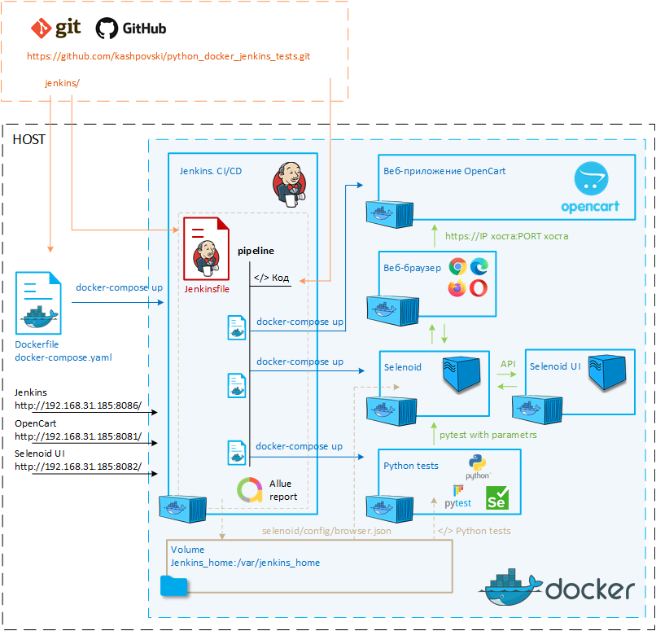

# Автоматизация тестирования веб-приложения OpenCart на базе Jenkins, Docker, Selenoid и Python/Pytest
***
### Используемые технологии:
- Jenkins (CI/CD)
- Docker 
- Selenoid 
- Python (pytest + selenium + xdist)
- Allure 
- Git
***
### Архитектура программы:
Программа выполняет автоматизированное UI-тестирование сайта OpenCart с 
использованием подхода CI/CD, при этом все тестовое окружение разворачивается 
в среде Docker. Тесты написаны на языке высокоуровневого программирования Python 
с применением Framework pytest и библиотек selenium, xdist. Архитектура кода тестов 
написана по паттерну PageObject. Код располагается в публичном Git репозитории 
(https://github.com/kashpovski/python_docker_jenkins_tests.git). 
CI/CD реализован на базе Jenkins развёрнутое в Docker, все шаги выполнения программы 
описаны в pipeline. В качестве инструмента для автоматизированного управления браузерами 
используется Selenoid.
Шаги выполнения программы (jenkinsfile):
1. Задаются и определяются параметры запуска тестов;
2. Выполняется скачивание кода с Git-репозитория:
3. Запускается веб-приложение OpenCart в Docker;
4. Запускается Selenoid в Docker;
5. Собирается контейнер с Python в Docker, устанавливаются необходимые 
зависимости и запускаются тесты с заданными параметрами;
6. Завершается работа всех запущенных контейнеров в Docker (OpenCart, Selenoid, Python);
7. Выполняется сбор артефактов (логи работы тестов);
8. Формирование отчета Allure.

***
### Запуск и работа с программой:
Перед началом запуска программы необходимо установить и настроить Docker у себя на компьютере. 
Инструкция по установке на официальном сайте https://docs.docker.com/engine/install/

>Кроме того по умолчанию в проекте используются следующие браузеры для Selenoid:
>- Chrome (106.0, 107.0)
>- Firefox (105.0, 106.0)
>- Opera (90.0, 91.0)
>- MicrosoftEdge (106.0, 105.0)
>
>Если необходимо использовать другие браузеры, требуется дополнительно скачать образ необходимого 
браузера (https://aerokube.com/images/latest/)
>
>     docker pull [наименование образа]
>и внести изменения в файл */workspace/[имя job Jenkins pipeline]/selenoid/config/browsers.json* 
внутри volume jenkins_home (это действие делается поле того как Jenkins будет запущен а job создана).

1. Установка и запуск Jenkins

Скачать локально на компьютер **Dockerfile** и **docker-compose.yml** с Git репозитория 
https://github.com/kashpovski/python_docker_jenkins_tests/tree/main/jenkins. 
По умолчанию для работы веб Jenkins используется порт **8086**, 
его можно поменять в **docker-compose.yml** в разделе “ports:”

Запустить Jenkins в Docker. Выполнить команду из директории, 
где располагаются скачанные **Dockerfile** и **docker-compose.yml** 
    
    docker-compose up
В Docker будет создан и запущен контейнер под именем jenkins_tests и volume под именем jenkins_home.

>jenkins_home хранить все файлы из дирректории */var/jenkins_home* 
и содержит настройки Jenkins (плагины, настройки, джобы)

Запустить Jenkins в веб браузере [http://[ip адрес хоста]:8086/](http://[ip адрес хоста]:8086/):
- Для активации выполнить команду, полученный текст ввести в поле и продолжить

      docker exec [контейнер id] cat /var/jenkins_home/secrets/initialAdminPassword
- Установить плагины: для старта выбрать стандартный набор плагинов – **Install suggested plugins**
- Создать пользователя администратора: Заполнить все поля (обязательно)
- Установить URL: указать тот что будет использоваться [http://[ip адрес хоста]:8086/]()

Остановка Jenkins

    docker-compose down

2. Настройка Jenkins

Заходим в Jenkins [http://[ip адрес хоста]:8086/](http://[ip адрес хоста]:8086/). 
Вводим учетные данные которые были созданы ранее.

Установить плагин **Allure Plugin** (https://plugins.jenkins.io/allure-jenkins-plugin/)

Выполнить настройку **"Allure Commandline"** в **Global Tool Configuration**

Создать job pipeline. Указываем пользовательское наименование. Переходим в настройки job:
- В разделе Pipeline: указываем **“Pipeline script from SCM”**
- в качестве SCM выбираем **Git**
- Repository URL – Git репозиторий программы https://github.com/kashpovski/python_docker_jenkins_tests.git
- Branch - **\*/main**
- Script path - **jenkins/jenkinsfile**

Сохранить job

3. Запуск тестов

>После настройки Jenkins выполнить первый запуск job с параметрами по умолчанию.

> При следующих запусках можно указывать пользовательские параметры при запуске.

Для запуска тестов необходимо **запустить выполнение job**, 
при этом выполняются все этапы программы и в конечном итоге будет получен отчет **Allure**.

Доступ к ресурсам программы по умолчанию:
- Jenkins - http://192.168.31.185:8086/
- OpenCart - http://192.168.31.185:8081/
- Selenoid UI - http://192.168.31.185:8082/